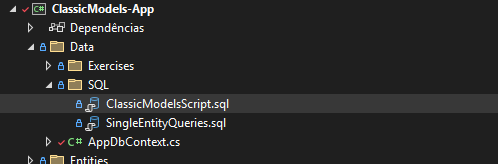
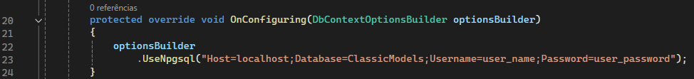
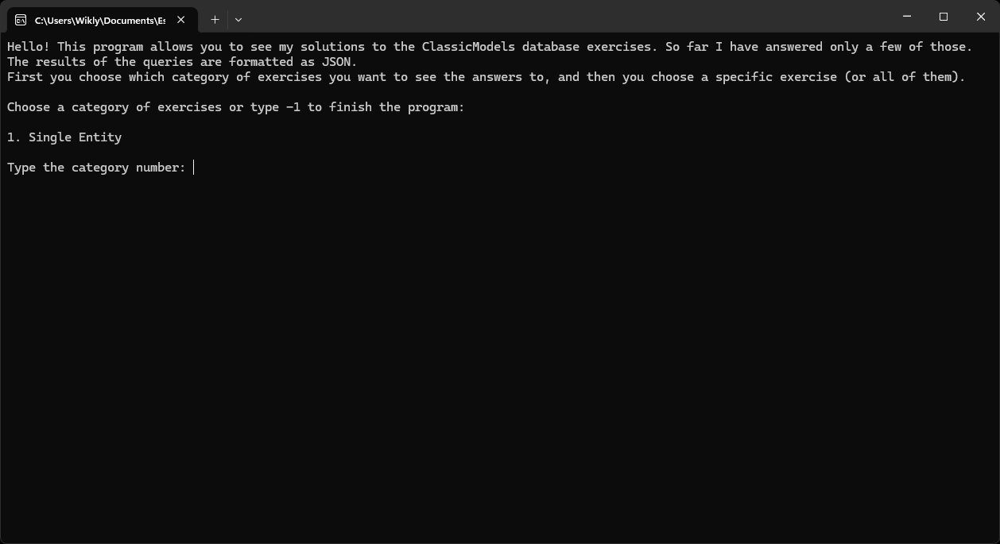
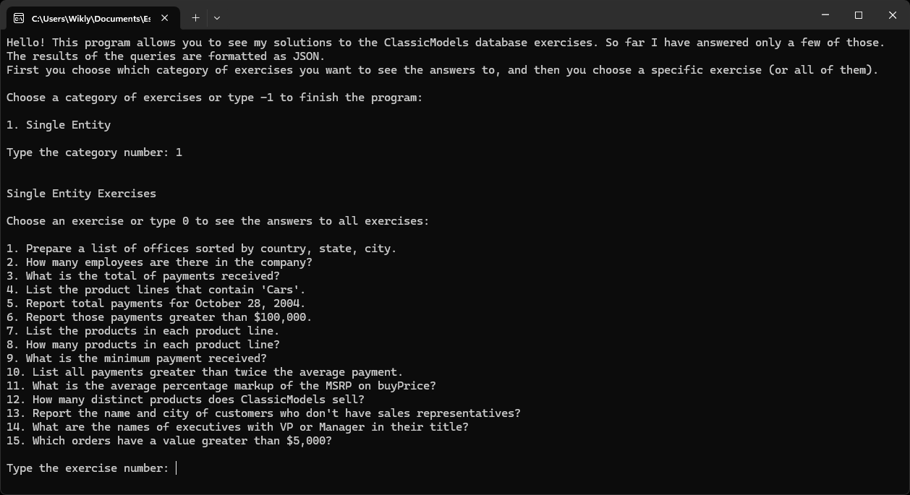
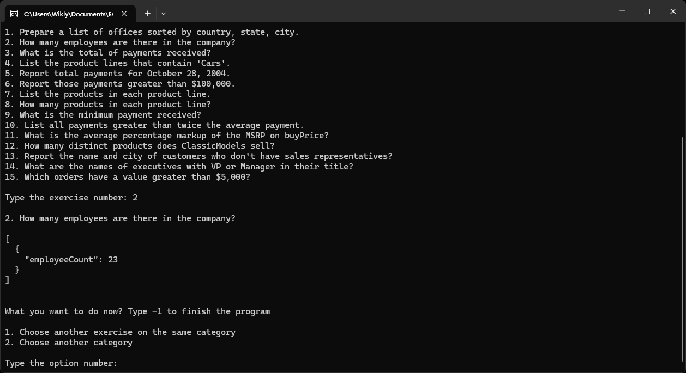

# ClassicModels App

Study project in C#.NET, focusing on learning Entity Framework Core and
PostgreSQL, using the ClassicModels database as a reference. The project covers
entity modeling, relationship configuration, and query execution. Queries are
initially written in SQL to ensure correctness and understanding, and then
transcribed into LINQ to solve SQL-based exercises.

The project is being developed in .NET 8 using Visual Studio 2022 Community
Edition.

ClassicModels is a fictitious company. It's a retailer of scale models of
classic cars. It contains typical business data, including information about
customers, products, sales orders, sales order line items, and more.

The [exercises](https://www.richardtwatson.com/open/Reader/ClassicModels.html)
are found in an instructor’s manual the accompanies the book
[Data Management: Databases and Analytics (open edition)](https://www.richardtwatson.com/open/Reader/_book/data-management-databases-and-analytics.html),
by [Richard T. Watson](https://www.richardtwatson.com). You can read more about
it [here](https://www.richardtwatson.com/open/Reader/_book/preface.html#supplements).

The ClassicModels App is a .NET Console App that allows the user to choose an
exercise (or all exercises) out of a category and see the results of the queries
that answer the proposed exercises.

## How to use

- Clone the repository.

- Use the `ClassicModelsScript.sql` file, found in the `SQL` directory, to  
  create and populate the tables.  
  

- Set the connection string in the `AppDbContext.cs` file.  
  

- Run the project.

---

When you run the project, you'll see a presentation message followed by the
category list in the terminal:  

Now, type the number of the category for which you want to see the exercise
list. In this example, the "Single Entity" category was selected:  

Now, choose which exercise you want to see the solution for. For example, let's
choose exercise number 2:  

You will now see the answer to that exercise, along with the option to view the
answer to another exercise in the same category, or to return to the list of
categories and select a different category.

